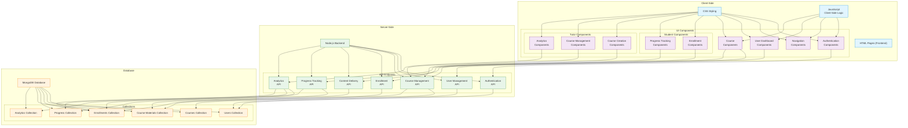

```mermaid
flowchart TB
    subgraph "Client-Side"
        HTML["HTML Pages (Frontend)"]
        CSS["CSS Styling"]
        JS["JavaScript\nClient-Side Logic"]
        
        subgraph "UI Components"
            Nav["Navigation\nComponents"]
            Auth["Authentication\nComponents"]
            UserDash["User Dashboard\nComponents"]
            CourseComp["Course\nComponents"]
            
            subgraph "Student Components"
                EnrollComp["Enrollment\nComponents"]
                ProgressComp["Progress Tracking\nComponents"]
            end
            
            subgraph "Tutor Components"
                CourseCreate["Course Creation\nComponents"]
                CourseManage["Course Management\nComponents"]
                Analytics["Analytics\nComponents"]
            end
        end
        
        JS --> Auth & Nav & UserDash & CourseComp
        CSS --> Auth & Nav & UserDash & CourseComp & EnrollComp & ProgressComp & CourseCreate & CourseManage & Analytics
    end
    
    subgraph "Server-Side"
        Backend["Node.js Backend"]
        
        subgraph "API Endpoints"
            AuthAPI["Authentication\nAPI"]
            UserAPI["User Management\nAPI"]
            CourseAPI["Course Management\nAPI"]
            EnrollAPI["Enrollment\nAPI"]
            ContentAPI["Content Delivery\nAPI"]
            ProgressAPI["Progress Tracking\nAPI"]
            AnalyticsAPI["Analytics\nAPI"]
        end
        
        Backend --> AuthAPI & UserAPI & CourseAPI & EnrollAPI & ContentAPI & ProgressAPI & AnalyticsAPI
    end
    
    subgraph "Database"
        MongoDB["MongoDB Database"]
        
        subgraph "Collections"
            Users["Users Collection"]
            Courses["Courses Collection"]
            Enrollments["Enrollments Collection"]
            Progress["Progress Collection"]
            Materials["Course Materials Collection"]
            Analytics_DB["Analytics Collection"]
        end
        
        MongoDB --> Users & Courses & Enrollments & Progress & Materials & Analytics_DB
    end
    
    %% Connections between layers
    Auth --> AuthAPI
    UserDash --> UserAPI
    CourseComp --> CourseAPI & ContentAPI
    EnrollComp --> EnrollAPI
    ProgressComp --> ProgressAPI
    CourseCreate & CourseManage --> CourseAPI
    Analytics --> AnalyticsAPI
    
    AuthAPI --> Users
    UserAPI --> Users
    CourseAPI --> Courses & Materials
    EnrollAPI --> Enrollments
    ContentAPI --> Materials
    ProgressAPI --> Progress & Enrollments
    AnalyticsAPI --> Analytics_DB & Progress & Enrollments
    
    %% Style definitions
    classDef frontend fill:#E1F5FE,stroke:#0288D1,stroke-width:1px;
    classDef backend fill:#E8F5E9,stroke:#388E3C,stroke-width:1px;
    classDef database fill:#FFF3E0,stroke:#F57C00,stroke-width:1px;
    classDef components fill:#F3E5F5,stroke:#7B1FA2,stroke-width:1px;
    
    %% Apply styles
    class HTML,CSS,JS frontend;
    class Backend,AuthAPI,UserAPI,CourseAPI,EnrollAPI,ContentAPI,ProgressAPI,AnalyticsAPI backend;
    class MongoDB,Users,Courses,Enrollments,Progress,Materials,Analytics_DB database;
    class Nav,Auth,UserDash,CourseComp,EnrollComp,ProgressComp,CourseCreate,CourseManage,Analytics components;
``` 