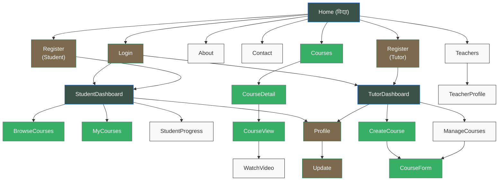

```mermaid
flowchart TD
    Home["Home (विद्या)"]
    
    %% Main navigation paths
    Home --> Courses
    Home --> Teachers
    Home --> About
    Home --> Contact
    
    %% Authentication paths
    Home --> Login
    Home --> Register["Register\n(Student)"]
    Home --> TutorRegister["Register\n(Tutor)"]
    
    %% Student paths
    Login --> StudentDashboard
    Register --> StudentDashboard
    StudentDashboard --> BrowseCourses
    StudentDashboard --> MyCourses
    StudentDashboard --> StudentProgress
    
    %% Tutor paths
    Login --> TutorDashboard
    TutorRegister --> TutorDashboard
    TutorDashboard --> CreateCourse
    TutorDashboard --> ManageCourses
    
    %% Course related paths
    Courses --> CourseDetail
    CourseDetail --> CourseView
    CreateCourse --> CourseForm
    ManageCourses --> CourseForm
    
    %% Teacher paths
    Teachers --> TeacherProfile
    
    %% Course content paths
    CourseView --> WatchVideo
    
    %% User profile
    StudentDashboard --> Profile
    TutorDashboard --> Profile
    Profile --> Update
    
    %% Style definitions
    classDef default fill:#f9f9f9,stroke:#333,stroke-width:1px;
    classDef primary fill:#3B5249,stroke:#0d6efd,color:white,stroke-width:1px;
    classDef secondary fill:#37AF65,stroke:#6c757d,color:white,stroke-width:1px;
    classDef auth fill:#7D6A4E,stroke:#198754,color:white,stroke-width:1px;
    
    %% Apply styles
    class Home,StudentDashboard,TutorDashboard primary;
    class Courses,CourseDetail,CourseView,CourseForm,CreateCourse,MyCourses,BrowseCourses secondary;
    class Login,Register,TutorRegister,Profile,Update auth;
``` 