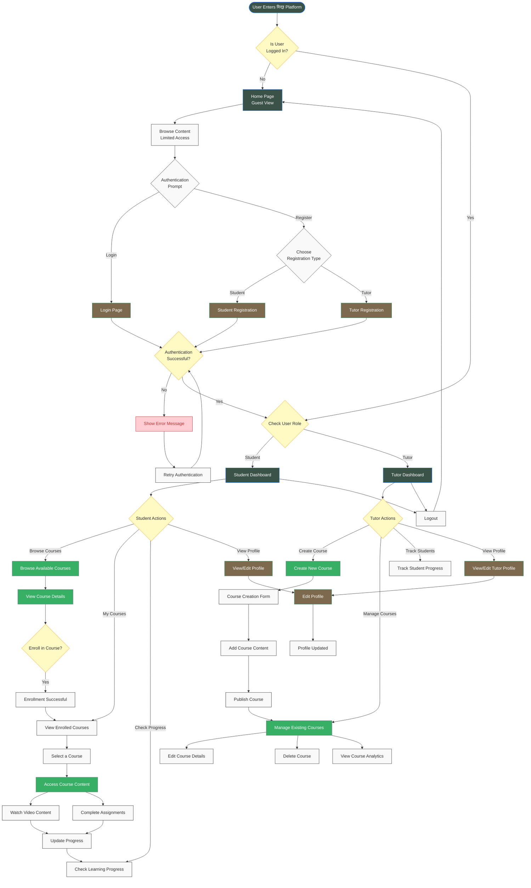

```mermaid
flowchart TD
    Start([User Enters विद्या Platform]) --> IsLoggedIn{Is User\nLogged In?}
    
    %% Not logged in flow
    IsLoggedIn -->|No| GuestHome[Home Page\nGuest View]
    GuestHome --> BrowseContent[Browse Content\nLimited Access]
    BrowseContent --> AuthPrompt{Authentication\nPrompt}
    AuthPrompt -->|Login| Login[Login Page]
    AuthPrompt -->|Register| Choose{Choose\nRegistration Type}
    Choose -->|Student| StudentReg[Student Registration]
    Choose -->|Tutor| TutorReg[Tutor Registration]
    
    %% Authentication flows
    Login --> AuthSuccess{Authentication\nSuccessful?}
    StudentReg --> AuthSuccess
    TutorReg --> AuthSuccess
    AuthSuccess -->|No| AuthError[Show Error Message]
    AuthError --> RetryAuth[Retry Authentication]
    RetryAuth --> AuthSuccess
    
    %% Logged in flow - Common
    AuthSuccess -->|Yes| CheckRole{Check User Role}
    IsLoggedIn -->|Yes| CheckRole
    
    %% Student flow
    CheckRole -->|Student| StudentHome[Student Dashboard]
    StudentHome --> StudentActions{Student Actions}
    StudentActions -->|Browse Courses| BrowseCourses[Browse Available Courses]
    StudentActions -->|My Courses| MyCourses[View Enrolled Courses]
    StudentActions -->|Check Progress| MyProgress[Check Learning Progress]
    StudentActions -->|View Profile| ProfileView[View/Edit Profile]
    
    BrowseCourses --> CourseDetails[View Course Details]
    CourseDetails --> EnrollCourse{Enroll in Course?}
    EnrollCourse -->|Yes| EnrollSuccess[Enrollment Successful]
    EnrollSuccess --> MyCourses
    
    MyCourses --> SelectCourse[Select a Course]
    SelectCourse --> CourseContent[Access Course Content]
    CourseContent --> WatchVideo[Watch Video Content]
    CourseContent --> CompleteAssignment[Complete Assignments]
    WatchVideo & CompleteAssignment --> UpdateProgress[Update Progress]
    UpdateProgress --> MyProgress
    
    %% Tutor flow
    CheckRole -->|Tutor| TutorHome[Tutor Dashboard]
    TutorHome --> TutorActions{Tutor Actions}
    TutorActions -->|Create Course| CreateCourse[Create New Course]
    TutorActions -->|Manage Courses| ManageCourses[Manage Existing Courses]
    TutorActions -->|Track Students| TrackStudents[Track Student Progress]
    TutorActions -->|View Profile| TutorProfile[View/Edit Tutor Profile]
    
    CreateCourse --> CourseForm[Course Creation Form]
    CourseForm --> AddContent[Add Course Content]
    AddContent --> PublishCourse[Publish Course]
    PublishCourse --> ManageCourses
    
    ManageCourses --> EditCourse[Edit Course Details]
    ManageCourses --> DeleteCourse[Delete Course]
    ManageCourses --> ViewAnalytics[View Course Analytics]
    
    %% Common actions
    ProfileView & TutorProfile --> EditProfile[Edit Profile]
    EditProfile --> UpdateSuccess[Profile Updated]

    %% Logout flow
    StudentHome & TutorHome --> Logout[Logout]
    Logout --> GuestHome
    
    %% Style definitions
    classDef default fill:#f9f9f9,stroke:#333,stroke-width:1px;
    classDef primary fill:#3B5249,stroke:#0d6efd,color:white,stroke-width:1px;
    classDef secondary fill:#37AF65,stroke:#6c757d,color:white,stroke-width:1px;
    classDef auth fill:#7D6A4E,stroke:#198754,color:white,stroke-width:1px;
    classDef decision fill:#FFF9C4,stroke:#FFA000,stroke-width:1px;
    classDef error fill:#FFCDD2,stroke:#D32F2F,color:#D32F2F,stroke-width:1px;
    
    %% Apply styles
    class Start,GuestHome,StudentHome,TutorHome primary;
    class BrowseCourses,CourseDetails,CourseContent,ManageCourses,CreateCourse secondary;
    class Login,StudentReg,TutorReg,ProfileView,TutorProfile,EditProfile auth;
    class IsLoggedIn,AuthSuccess,CheckRole,EnrollCourse,StudentActions,TutorActions decision;
    class AuthError error;
``` 